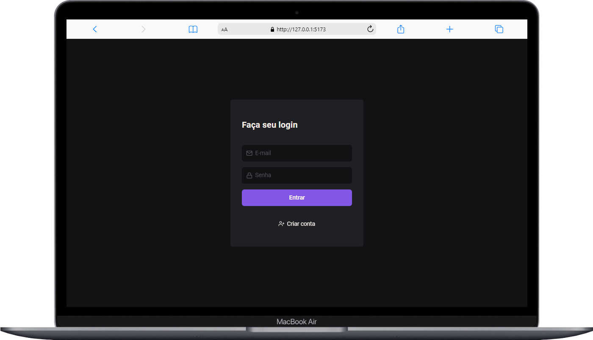
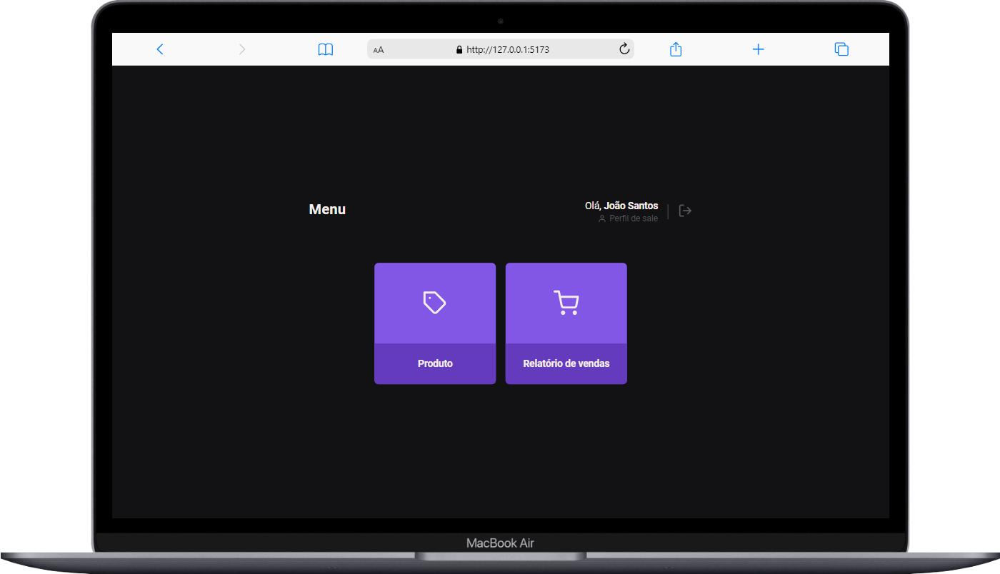

<h1 align="center">project for training cookies
</h1>

## 🚀 Tecnologias

this project has desenvolved with this technologies

- HTML
- CSS
- JavaScript
- nodeJS
- ReactJS
- ViteJS

## PRINCIPAL APRENDIZADO
use cookies for protect sensitive data

## sobre
project desenvolved on course explorer of the rocketseat

## 💻 Projeto Fotos

 
 <h3>perfil administrador</h3>
 
 <h3>perfil vendedor</h3>
 

